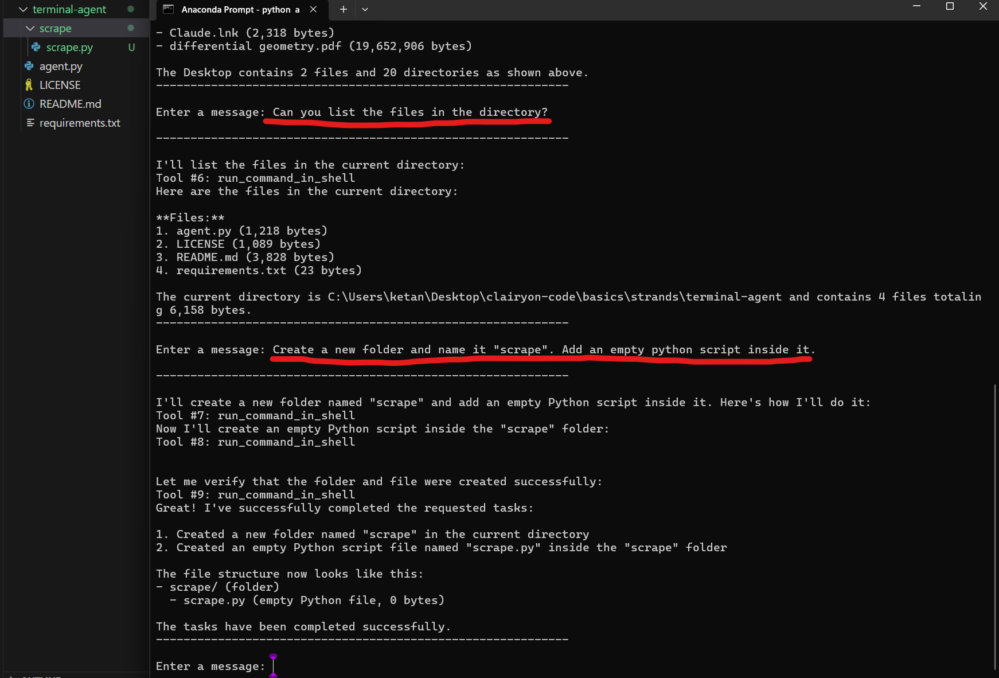

# Shell Command Executor Agent with Strands Agents SDK

(This agent currently does not ask for permission to run a command-- Contributions are welcome.)

Why create tools for each function?
This project implements a conversational AI agent that can execute arbitrary shell commands on the host system and return their output or error messages via a natural language interface. While the current implementation utilizes the Claude-3 model via AWS Bedrock, the agent is designed to be compatible with any model supported by the Strands library, offering flexibility in model selection.



---

## Features

* Integrates with any model supported by the Strands library.
* Provides a custom tool to run shell commands securely.
* Offers an interactive command-line interface to send messages and receive responses.

---

## Requirements

* Python 3.8+
* Access to a model via the Strands library (e.g., Anthropic Claude-3 via AWS Bedrock)
* `strands-agents` Python package (for `BedrockModel`, `Agent`, and `tool` decorators)

---

## Installation

1. Clone the repository:

   ```bash
   git clone https://github.com/Ketansuhaas/terminal-agent.git
   cd terminal-agent
   ```

2. Install dependencies:

   ```bash
   pip install strands-agents boto3
   ```

3. Configure your model access as per the Strands documentation.

---

## Usage

Run the main script to start an interactive prompt:

```bash
python agent.py
```

* Enter any natural language message or shell command request.
* The agent will interpret the message and may execute shell commands if appropriate.
* To exit, type `exit`.

## Security Warning

**WARNING:** This tool executes shell commands on your local machine. Use with caution and only in trusted environments. Avoid running commands that may compromise your system or data.

---

## License

This project is licensed under the MIT License. See [LICENSE](LICENSE) for details.
